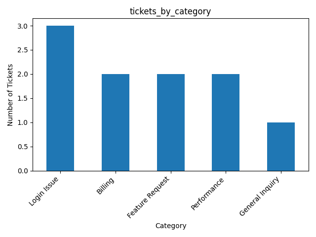

# Customer Support Ticket Analytics (Mini Project)

## Overview
A small end-to-end analytics project to analyze customer support tickets and identify workload drivers, response performance, and SLA risk.

## Dataset
Sample ticket dataset with:
- created date
- first response time (hours)
- resolution time (hours)
- priority, category, status

## Key KPIs

- Total tickets analyzed: **10**
- Average first response time: **7.0 hours**
- Average resolution time: **27.5 hours**
- First-response SLA breach rate: **30%**

## Visuals

### Tickets by Category


### SLA Breach Rate by Priority


## Business Questions & Answers

- **What is the average first response time and resolution time?**  
  Average first response time is **7.0 hours**, while average resolution time is **27.5 hours**.

- **Which categories generate the most tickets?**  
  Login Issues generate the highest volume of tickets, followed by Billing, Feature Requests, and Performance-related issues.

- **What percentage of tickets breach the first-response SLA?**  
  **30%** of tickets breach the 8-hour first response SLA.

- **Which priorities have the highest SLA breach rate?**  
  Low priority tickets have the highest SLA breach rate (**50%**), while High and Medium priority tickets both show a **25%** breach rate.

## Key Insights

- Login-related issues are the primary driver of support workload and may benefit from product or UX improvements.
- Despite lower urgency, low-priority tickets are most likely to breach SLAs, indicating potential deprioritization risk.
- Ticket volume is consistent across days, suggesting stable demand rather than spikes or outages.


## How to Run
```bash
python -m venv .venv
source .venv/bin/activate
pip install -r requirements.txt
